<h1>I developed an E-Commerce website using Asp.Net Core 5 MVC.</h1>

<ul>
   <li>On the website, users can search for products, filter them using categories, and also find out the latest information about the products.</li>
   <li>Users can register on the site using their Google or Facebook accounts. Similarly, the admin can add new users or admins using the preferred option.</li>
   <li>The admin can update the status of products. CRUD operations have been implemented for products, categories, and users. Additionally, the admin can filter orders.</li>
 </ul>  

MAİN PAGE
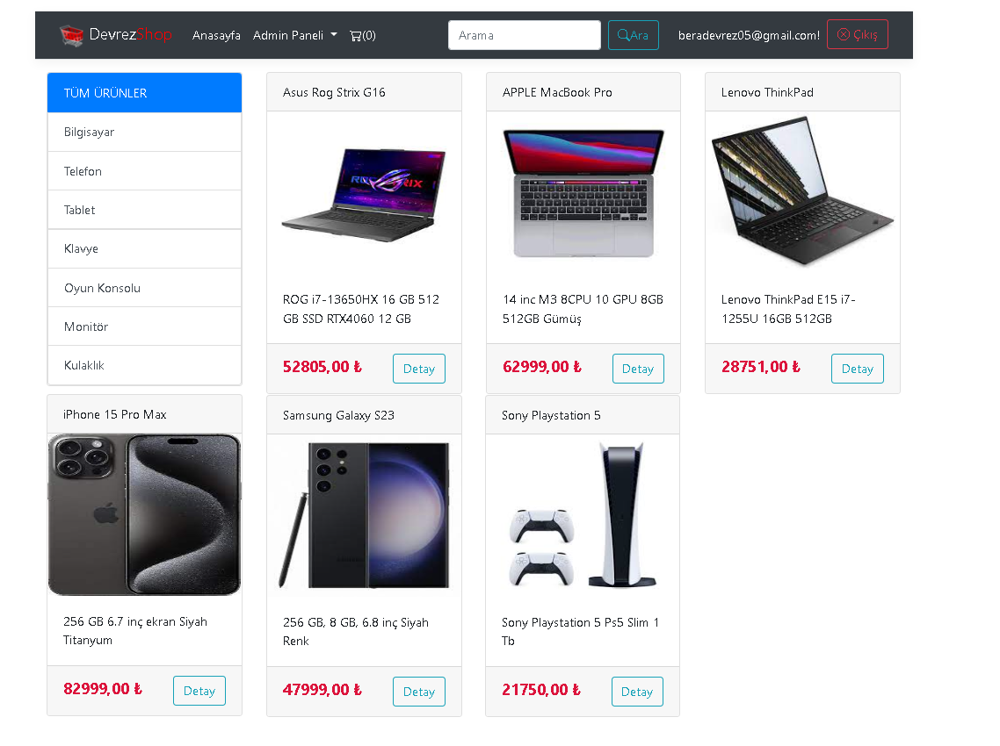

PAGE-2
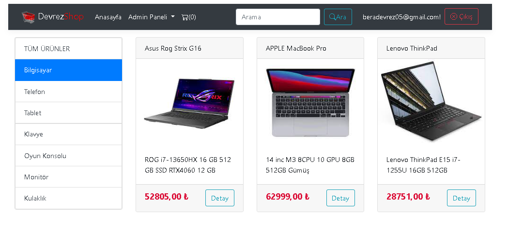

PAGE-3
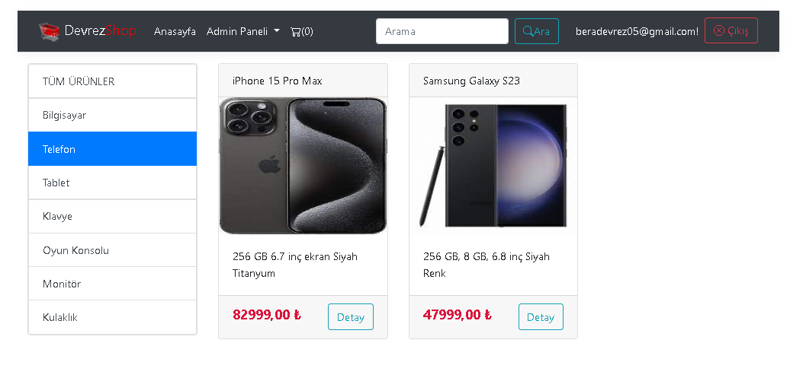

PRODUCT DETAIL
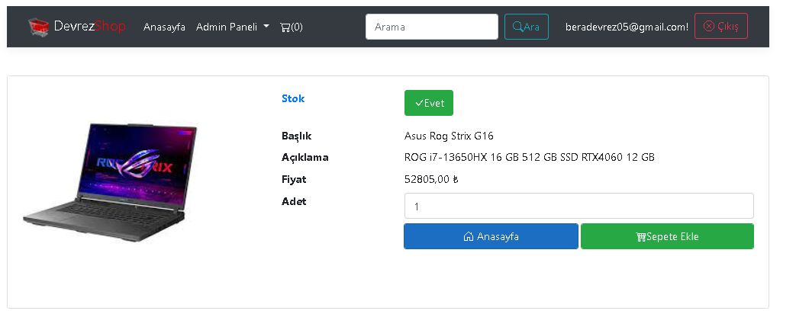

PRODUCT DETAIL-2
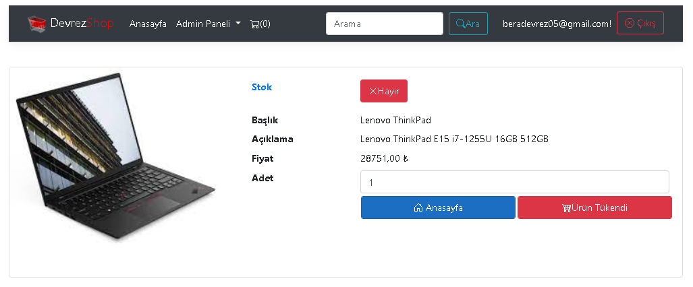

ADMİN PRODUCT AND CATEGORY MAİN PAGE
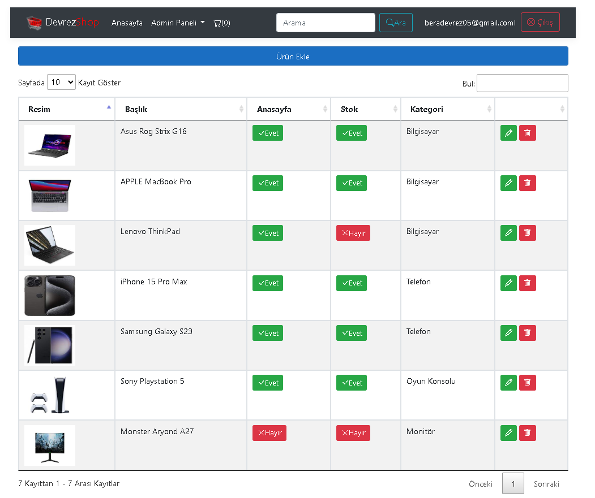
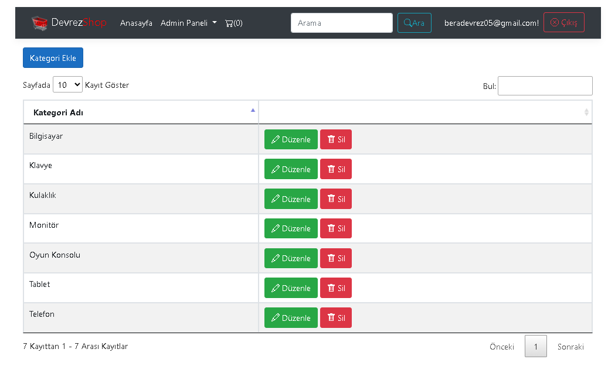

ORDER PROCESS
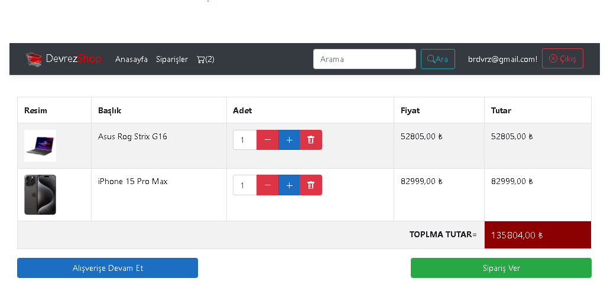
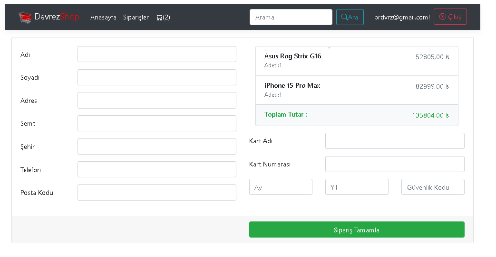

CUSTOMER ORDER TRACKING
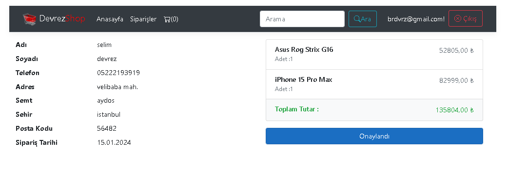
PAGE-2
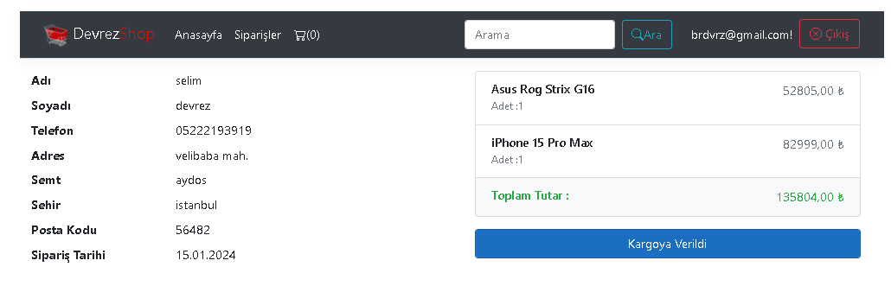

ADMİN ORDER TRACKING
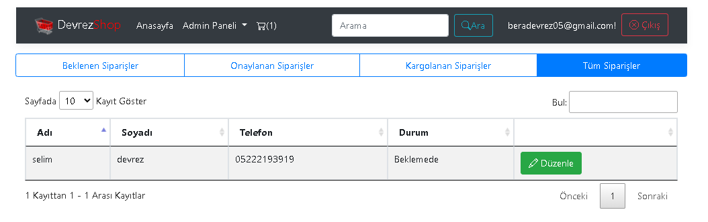
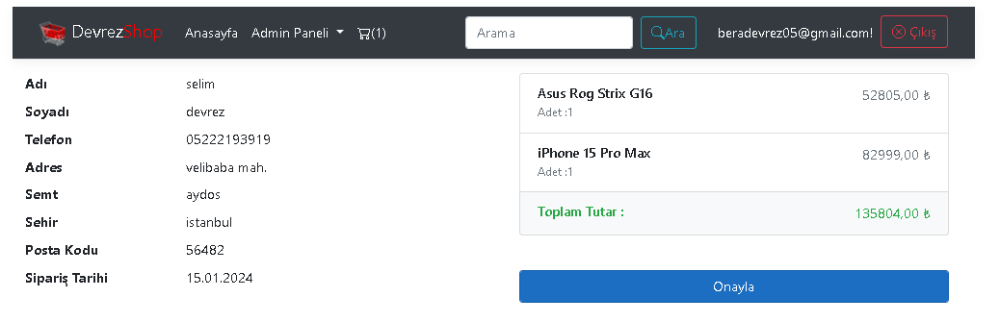
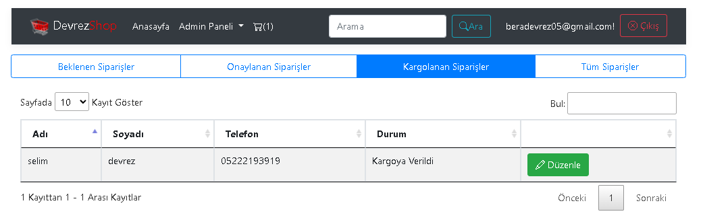
